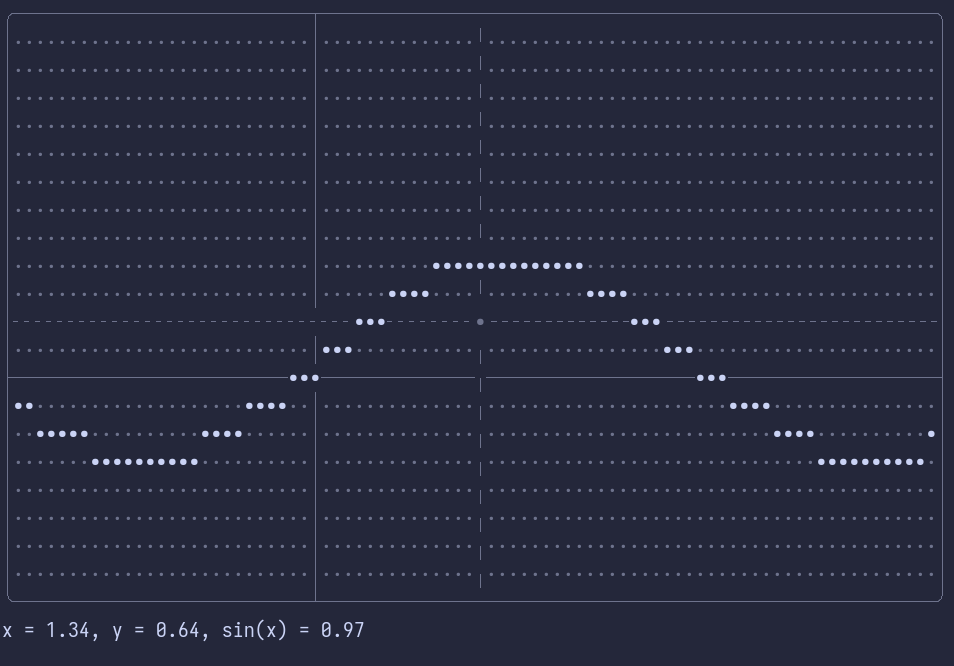

# Daphne
### Software in process of development. Don't have any high expectations.
Daphne is a simple math shell which allows perform basic calculations.

## Quick Start
```console
$ git clone https://github.com/Sylphri/daphne
$ cd daphne
$ cargo run
```

## Shell Reference
### Expressions
Expressions can consist of numbers, basic operations, sums, products and functions calls.
### Numbers
You can use arbitrary real numbers. Dot `.` used as separator between integer and fractional parts.
```example
-> 3.14
```
Leading or trailing zeros can be omitted.
```example
-> .5 (same as 0.5)
```
### Basic Operations
Operation | Description
:--------:|------------
`+` | Addition
`-` | Subtraction
`*` | Multiplication
`/` | Division
`^` | Exponentiation
```example
-> 3.5 + 9^2
 = 84.5
```
Also you can rearrange priorities of operations with parenthesis.
```example
-> (2 + 3) * 4
 = 20
```
### Sums and Products
You can calculate sum or product of some sequence with sums and products.

Sum operation have next syntax: 

    (sum lower_bound upper_bound step with ident: expr)
  
Where `lower_bound` is inclusive, `upper_bound` is exclusive, `ident` is name of iterative variable which contains current value for each iteration and `expr` is expression which would evaluated on each iteration.

In this example we are summing up all natural numbers from 1 to 9.
```example
-> (sum 1 10 1 with it: it)
 = 45
```

Product have the same syntax but with keword `prod` instead `sum`.
### Function Calls
You can use builtin and user-defined functions in expressions.

Function calls have next syntax:

    ident(param, param, param, ...)

Where `ident` is a name of called function and `param` is arbitrary expression.
```example
-> sin(3.14)
 = 0.001592...
```
### Function Definitions
To define a new function you need to use keyword `def`.

    def ident(arg, arg, arg, ...) = expr

Where `ident` is a function name, each `arg` is a name of argument and `expr` is a function body.
```example
-> def vec2_len(a, b) = sqrt(a*a + b*b)
  Successfully defined
-> vec2_len(3, 4)
 = 5
```
### Builtin Functions and Std module
There are some functions out of the box, some of them are builtin and some are in `std` module.

You can get list of builtin functions by entering command `builtin`.
```example
-> builtin
  abs(x)    - Computes the absolute value of x.
  sin(x)    - Computes the sine of x (in radians).
  ...
```

And to get functions from std module you can use command `load`.
```example
-> load std
  Successfully loaded 19 functions
```
Be careful, command `load` accepts file path as a parameter, so example above may not work if you in a wrong folder.

### Commands
Command | Description
--------|------------
help | Prints help message
builtin | Prints list of builtin functions
exit | Exits the program
save <path> | Saves all defined functions into provided file
load <path> | Loads functions from provided file
list [flags] | Prints list of defined functions
remove [flats] [ident] ... | Removes provided functions
plot <ident> | Plots given function

Yes, you can do plots with this tool.


